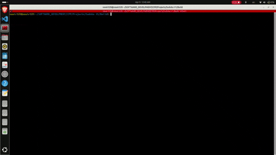

# Sudoku Game V1 Project
## Author: [Mohamed Newir](https://www.linkedin.com/in/mohamed-newir-a8a572182)

## Overview
This project is part of a **Software Development Course** course at **Edges Academy** focusing on OOP concepts, STL, and application development.

## Project Description
This is a console-based implementation of the popular **Sudoku puzzle**, built in **C++** using a modular, object-oriented approach. The project emphasizes clean design, separation of concerns, and practical use of the Standard Template Library (STL).

## The game supports the following functionalities:
- **Interactive Console Interface**: Play, solve, load, and save puzzles.
- **Backtracking Solver**: Solve any valid Sudoku puzzle.
- **Input Validation**: Ensures all moves and file inputs are correct.
- **Optional Features**:
  - Puzzle Generation with different difficulty levels (Easy, Medium, Hard).

## Features
- Load puzzle from a file.
- Enter and validate player moves.
- Solve puzzles automatically using a backtracking algorithm.
- Save the current puzzle state to a file.
- Modular class structure to support scalability.

## Default Puzzle

### Upon starting, the Sudoku program displays the default board :

```
-------------------------
| 5 3 . | . 7 . | . . . |
| 6 . . | 1 9 5 | . . . |
| . 9 8 | . . . | . 6 . |
-------------------------
| 8 . . | . 6 . | . . 3 |
| 4 . . | 8 . 3 | . . 1 |
| 7 . . | . 2 . | . . 6 |
-------------------------
| . 6 . | . . . | 2 8 . |
| . . . | 4 1 9 | . . 5 |
| . . . | . 8 . | . 7 9 | 
-------------------------
|====================================| 
|========== Sudoku Game Menu ========| 
|====================================| 
|1. Enter a move                     | 
|2. Solve a puzzle automatically     | 
|3. Generate a new puzzle            | 
|4. Load a saved game                | 
|5. Save current game                | 
|6. Exit                             | 
|====================================| 
|Enter your choice:
```


## Project Objectives
- Implement a fully functional Sudoku engine using a clean, modular structure.
- Demonstrate separation of concerns and proper software architecture.

## Functional Requirements
- Display a 9×9 Sudoku board in the terminal using ASCII format.
- Provide a console-based menu to:
  1. Enter a move.
  2. Solve the puzzle automatically.
  3. Generate a new puzzle
  4. Load puzzle from a file.
  5. Save puzzle to a file.
  6. Exit the application.
- Validate user inputs (row, column, value).
- Detect and reject invalid moves.
- Display a completed solution or indicate if the puzzle is unsolvable.

## Class Architecture
- **SudokuBoard**: Manages the 9x9 grid, validation, and board display.
- **SudokuSolver**: Implements the recursive backtracking solver.
- **SudokuGame**: Manages the game loop and user interaction.
- **SudokuGenerator**: Generates valid Sudoku puzzles.

## File Management Architecture

## File Structure

```
Sudoku_Game_V1/
│-- Build/                  (Build directory generated by CMake)
│-- Include/                (Header files)
│   │-- SudokuBoard.hpp
│   │-- SudokuGame.hpp
│   │-- SudokuGenerator.hpp
│   │-- SudokuSolver.hpp
│-- Puzzle/                 (Puzzle text files)
│   │-- Default_Puzzle.txt
│-- Source/                 (Source code files)
│   │-- main.cpp
│   │-- SudokuBoard.cpp
│   │-- SudokuGame.cpp
│   │-- SudokuGenerator.cpp
│   │-- SudokuSolver.cpp
│-- Video/                  (Demo video and GIF)
│   │-- Sudoku Game V1.mp4
│   │-- SudokuGame.gif
│-- CMakeLists.txt          (CMake Build configuration)
│-- README.md               (Project documentation)
```
## Build Instructions
Ensure you have CMake and a C++ compiler installed:

```bash
cd Build
cmake ..
make
./Output
```

## Demo



---

### Stay tuned for [Sudoku Game V2](Project Link) featuring a **Qt++ GUI** interface built with C++!
