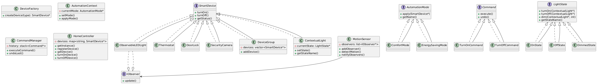

# Smart Home Automation System

**Author:** [Mohamed Newir](https://www.linkedin.com/in/mohamed-newir-a8a572182)

This project implements a Smart Home Automation System using C++. It allows users to control and monitor smart devices through both a Command Line Interface (CLI) and a Graphical User Interface (GUI).

## Running the Application

### CLI Version

To run the CLI version:

1. Navigate to the `Build` directory from the project root:

   ```bash
   cd Build
   ```

2. Execute the command:

   ```bash
   ./Output
   ```

### GUI Version  -Still in the implementation phase-

To run the GUI version:

1. Navigate to the `GUI/build/Desktop_Qt_6_9_0-Debug` directory from the project root:

   ```bash
   cd GUI/build/Desktop_Qt_6_9_0-Debug
   ```

2. Run the GUI application.

## Design Patterns Used

| Pattern          | Purpose                                                                 |
|------------------|-------------------------------------------------------------------------|
| **State**        | To manage various states of devices like Light (e.g., On, Off, Dimmed)  |
| **Observer**     | To notify the system of changes in device state                         |
| **Factory Method**| To create different types of smart devices dynamically                  |
| **Command**      | To encapsulate device commands like `TurnOn`, `TurnOff`, `Dim`          |
| **Singleton**    | For centralized `SmartHomeController` instance                          |
| **Strategy**     | To switch between control strategies if needed in future (e.g., CLI vs GUI) |
| **Composite**    | To treat individual devices and groups uniformly                        |

## File Structure

```
Smart Home Automation System/
├── Build/
│   ├── Output
│   └── ...
├── GUI/
│   ├── build/
│   │   └── Desktop_Qt_6_9_0-Debug/
│   │       └── ...
│   ├── Include/
│   │   └── ...
│   ├── lib/
│   │   └── libSmartHomeAutomationSystemLib.a
│   ├── main.cpp
│   ├── mainwindow.cpp
│   ├── mainwindow.h
│   └── mainwindow.ui
├── Include/
│   ├── automatedMode.hpp
│   ├── centralControl.hpp
│   ├── command.hpp
│   ├── deviceFactory.hpp
│   ├── deviceGroup.hpp
│   ├── devices.hpp
│   ├── doorLock.hpp
│   ├── light.hpp
│   ├── lightObserver.hpp
│   ├── lightState.hpp
│   ├── motionSensor.hpp
│   ├── observer.hpp
│   ├── securityCamera.hpp
│   └── thermostat.hpp
├── Source/
│   ├── automatedMode.cpp
│   ├── centralControl.cpp
│   ├── deviceFactory.cpp
│   ├── deviceGroup.cpp
│   ├── doorLock.cpp
│   ├── light.cpp
│   ├── lightObserver.cpp
│   ├── lightState.cpp
│   ├── main.cpp
│   ├── motionSensor.cpp
│   ├── s_command.cpp
│   ├── securityCamera.cpp
│   └── thermostat.cpp
├── UML/
│   └── Smart_Home_Automation_System.png
└── Video/
```

## UML Diagram



